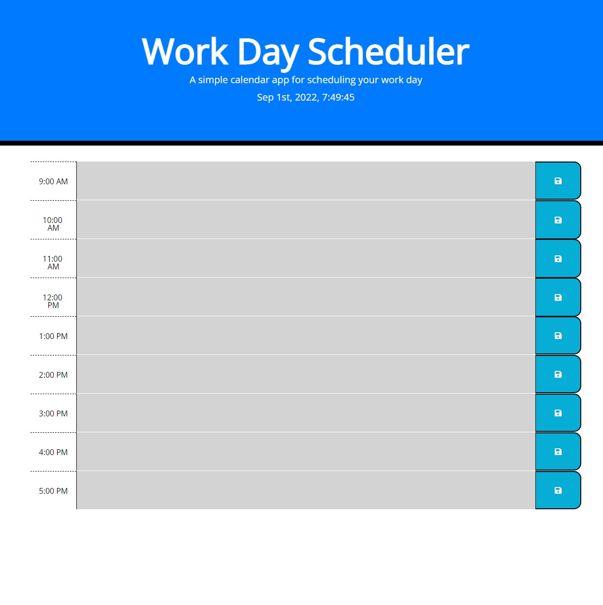

# workday-planner

My motivation today is create a work day scheduler that allows a user to save events for each hour of the day by modifying starter code.

* The work day scheduler should have the current day is displayed at the top of the calendar
* The timeblocks for standard business hours are displayed
* Each timeblocks for the day is color coded to indicate whether it is in the past, present, or future 
* The timeblocks can be edited to enter an event
* The event entered must be able to be saved through a save button
* The text for the event is saved in the local storage
* When refresh the page the saved events persist

## Usage
The usage of this source code is to demonstrate how a workday planner can be created using moment.js and jQuery. 

## Live URL
https://darrelwu.github.io/workday-planner/

## License
Copyright Darrel Wu 2022

Permission is hereby granted, free of charge, to any person obtaining a copy of this software and associated documentation files (the "Software"), to deal in the Software without restriction, including without limitation the rights to use, copy, modify, merge, publish, distribute, sublicense, and/or sell copies of the Software, and to permit persons to whom the Software is furnished to do so, subject to the following conditions:

The above copyright notice and this permission notice shall be included in all copies or substantial portions of the Software.

THE SOFTWARE IS PROVIDED "AS IS", WITHOUT WARRANTY OF ANY KIND, EXPRESS OR IMPLIED, INCLUDING BUT NOT LIMITED TO THE WARRANTIES OF MERCHANTABILITY, FITNESS FOR A PARTICULAR PURPOSE AND NONINFRINGEMENT. IN NO EVENT SHALL THE AUTHORS OR COPYRIGHT HOLDERS BE LIABLE FOR ANY CLAIM, DAMAGES OR OTHER LIABILITY, WHETHER IN AN ACTION OF CONTRACT, TORT OR OTHERWISE, ARISING FROM, OUT OF OR IN CONNECTION WITH THE SOFTWARE OR THE USE OR OTHER DEALINGS IN THE SOFTWARE.